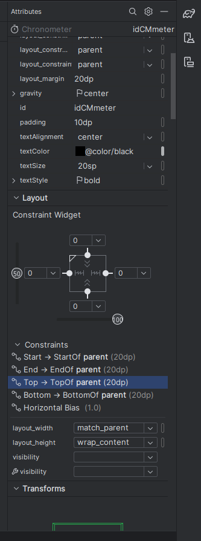

In the upcoming section of this tutorial, you will learn how different components work on your Android App. Our focus will be on two elements: the Chronometer and Buttons. 

## Add and remove new components
Let's navigate to the `app/res/layout/fragment_first.xml` file to locate the text displayed on the app.


In the Design editor's upper right corner, you'll find three icons representing different views: Code (code only), Split (code + design), and Design (design only). These views correspond to the same file, allowing you to modify code in any of them.


To begin, let's go to the code only section and replace the existing TextView code with a Chronometer component. Here's the updated XML code:

```xml
        <Chronometer
            android:id="@+id/idCMmeter"
            android:layout_width="match_parent"
            android:layout_height="wrap_content"
            android:layout_centerInParent="true"
            android:layout_margin="20dp"
            android:gravity="center"
            android:padding="10dp"
            android:textAlignment="center"
            android:textColor="@color/black"
            android:textSize="20sp"
            android:textStyle="bold"
            app:layout_constraintBottom_toBottomOf="parent"
            app:layout_constraintEnd_toEndOf="parent"
            app:layout_constraintHorizontal_bias="1.0"
            app:layout_constraintStart_toStartOf="parent"
            app:layout_constraintTop_toTopOf="parent" />
```

As you make this change, you may notice an error in the editor, indicating an issue with the Button. Simply remove the error part of the code until it looks like the final version shown below:


## Change components display and add new buttons

Let's enhance the app's layout by adjusting the display of components and introducing new buttons. Begin by switching back to the Design view, where you can see both, the button and the chronometer on the screen. Once you are there click on the white rectangular screen.


In the Common Attributes section of the Attributes panel, locate and set the **fillViewport** attribute to true.


Next, click on the button and move it below the chronometer. To add new buttons, drag and drop them from the palette onto the screen.


Repeat this process until you have four buttons on the screen, positioning them as shown in the image below. Ensure that the initial button created is placed below the three new ones.


You must change the name of the button and the text display on it. For it you must change the attribute id for the name and the attribute text to change the text of the button


- Left button: id = resetButton and text = Reset


- Middle button: id = startPauseButton and text = Start


- Right button: id = lapButton and text = Lap


- Bottom button: id = nextButton and text = Next


Don't take into account the lines that connect the components, only the attributes id and text from each component. The lines that connect each component are element constraints, you will learn more about them in the following section of the tutorial.

## Constraints

For constraints to show up, you must press on the component we want to change. We will first press on the chronometer. You will see the constraints are already created and the chronometer is connected to the top, bottom, left and right sides of the device.


If it is not already like this, you can add constraints by pressing on one of the big dots of the chronometer component and connecting it with the mouse to the 
appropiate element.

Also, onn the attributes section, there is a constraint menu where you can select a constraint and delete it manually.



You must add and delete constraints from the buttons as well. The final result of the constraints for each component must look like the following images:

:::tip[Next steps]
Once you have checked that all constraints match what you see on your project, you can continue to the [next section](../../development/style). Keep it up!
:::


