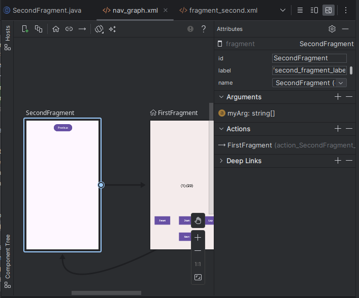
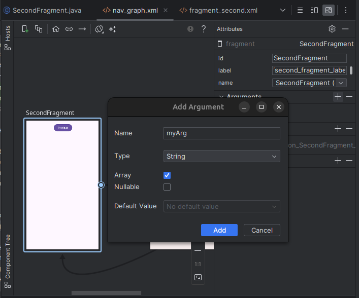

## Gradle script
First of all we must change from the Gradle Script some files to be able to use a pluggin which will help us to pass arguments from one fragment to another.

Lets go to Gradle Scripts/build.gradle.kts (Project: name of project) and add this lines of code
```java 
    buildscript {
    repositories {
        google()
    }
    dependencies {
        val nav_version = "2.5.3"
        classpath("androidx.navigation:navigation-safe-args-gradle-plugin:$nav_version")
    }
    }
```
 Afterwards lets go to Gradle Scripts/build.gradle.kts (Module: app). 
 Below the following line of code:
```java
   id("com.android.application")
```

you must add this line:
```java
   id("androidx.navigation.safeargs")
```

## First fragment
The initial step involves locating the document where we'll modify the functionality. Let's proceed to the directory `app/java/com.example.newproject/FirstFragment`. First, we need to include the necessary import for creating the chronometer.

```java
import android.widget.Chronometer;
```

Afterwards we will prepare all the variables we need for this project. 

```java
private FragmentFirstBinding binding;
private Chronometer chronometer; // Will let us know if the chronometer is on or off
boolean isRunning = false; // Will be set as initial moment that the chronometer is set
long base;
```

The variable stop will be utilized to capture the precise time when the chronometer is stopped. 
This is essential because the chronometer's base is set using SystemClock.elapsedRealtime(), 
which returns the time elapsed since the device was last booted, including any periods of deep sleep. As such, 
when we attempt to stop the chronometer, we aren't truly halting its countdown. Instead, the time since the device was booted continues to increase. 
Therefore, we need to obtain the specific stop time to accurately calculate the moment the chronometer was stopped.

```java
long stop;
```

The following variable will be used to compute the difference between the moment when the chronometer was stopped (stop) and the moment when it was started again (base). This computation is crucial because it helps to determine the exact duration of the chronometer's operation, taking into account any interruptions or pauses during its run time.

```java
long totalTime = 0;
```

Afterwards we will need to initialize the chronometer and a list which saves the time on each click on the lap button.
 
```java
super.onViewCreated(view, savedInstanceState);
chronometer = binding.idCMmeter;
List<String> lapList = new ArrayList<>();
```

Finally we will need to change the eventListener is already created and create a few more.
As we have change the id from the next button we must change the binding reference to the following:

```java
binding.nextButton.setOnClickListener(new View.OnClickListener(){
	...
}
```

As we will need to send some arguments to the second fragment, we must cast to an array of strings the list of lapList and send it to second fragment. This listener will finally look like this:

```java
binding.nextButton.setOnClickListener(new View.OnClickListener() {
            @Override
            public void onClick(View view) {
                String[] myArray = lapList.toArray(new String[0]);
                FirstFragmentDirections.ActionFirstFragmentToSecondFragment action = FirstFragmentDirections.actionFirstFragmentToSecondFragment(myArray);
                NavHostFragment.findNavController(FirstFragment.this).navigate(action);
            }
        });
```


We should also prepare the graph to accept this parameter. Fits, navigate to `app/res/navigation/nav_graph.xml`. 
Once there, select the SecondFragment screen. In the attributes section under arguments, if it says "Nothing to show", click on the '+' sign to add an argument.


Pressing on the + sign you will get the follwing screen, fill it as it is shown.



Lets get back to  the FirstFragment document to add more eventListeners. We must add them inside the onViewCreated function. 
For the reset button, we only need to reset the total time to zero and reinitialize the base. 
We'll keep the functionality of the chronometer as it was prior to pressing the start button. 
So, if the chronometer was stopped, it will remain stopped. Conversely, if it was running, the chronometer will resume running automatically.

```java
binding.resetButton.setOnClickListener(new View.OnClickListener() {
            @Override
            public void onClick(View view) {
                // on below line we are checking if
                // chronometer is running or not.
                stop = SystemClock.elapsedRealtime();
                totalTime = 0;
                base = SystemClock.elapsedRealtime() - totalTime;
                chronometer.setBase(base);
                if (isRunning){
                    chronometer.start();
                }
                else {
                    chronometer.stop();
                }
                lapList.clear();
            }
        });
    }
```

The next button will be the lap button. As it is described on the code, this function will prepare a string with the actual time that is set on the chronometer and save it on the array *lapList*.

```java
binding.lapButton.setOnClickListener(new View.OnClickListener() {
            @Override
            public void onClick(View view) {
                long millis = SystemClock.elapsedRealtime() - chronometer.getBase();

                int seconds = (int) (millis / 1000);
                int minutes = seconds / 60;
                seconds = seconds % 60;
                int hours = minutes / 60;
                minutes = minutes % 60;

                String lapTime = String.format("%d:%02d:%02d", hours, minutes, seconds);
                lapList.add(lapTime);
            }
        });
```

The last function will be the button of start/pause. This function will check if the chronometer was running or not
before pressing the button. In case it was running it will get the time where it stopped, to start afterwards from that time.
If it wasn't running it will calculate the base based on the totalTime of the chronometer on and start it.

```java
binding.startPauseButton.setOnClickListener(new View.OnClickListener() {
            @Override
            public void onClick(View view) {
                // on below line we are checking if
                // chronometer is running or not.
                if (isRunning) {
                    binding.startPauseButton.setText("Start");
                    isRunning = false;
                    stop = SystemClock.elapsedRealtime();
                    totalTime = stop - base;
                    chronometer.stop();
                } else {
                    binding.startPauseButton.setText("Stop");
                    isRunning = true;
                    base = SystemClock.elapsedRealtime() - totalTime;
                    chronometer.setBase(base);
                    chronometer.start();
                }
            }
        });
```

## Second fragment

For the second fragment you must prepare the code to get the parameters we are seding from the first fragment.
We receive it in a new string array called lapList and afterwards you will have to create a string to display the values of the lap on the screen.

```java
super.onViewCreated(view, savedInstanceState);
String[] lapList = SecondFragmentArgs.fromBundle(getArguments()).getMyArg();
String myString = String.join("\n", lapList);
binding.textviewSecond.setText(myString);
```

Congratulations! You have successfully completed this codelab. This hands-on experience serves as a solid foundation for further exploration and mastery of Android programming. Keep building, experimenting, and embracing the exciting world of mobile app development! If you have any questions or want to explore more advanced topics, [here are some links](../../additional/readings) that might be useful. Great job on completing this codelab!
