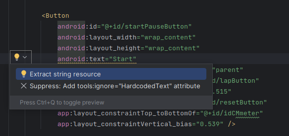
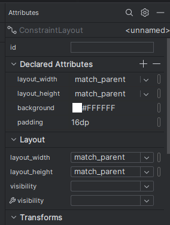

## Style 
On this second part we are going to talk about the style of the document.

## Hardcoded text
To address the warning about strings, we'll revisit the code section discussed earlier in the tutorial. 
Here, each button will display a line of text marked with a warning. To rectify this, click on the light bulb icon that appears next to the warning and choose the option to extract string resources. 
This process will move the hardcoded strings to the res/values/strings.xml file, ensuring they can be managed and localized more efficiently



After resolving each warning, a new window will appear. Click 'OK' to confirm. 
Repeat this process for every warning. The string resource will be added to the app/res/values/strings.xml file

## Change button colors
To change the button/chronometer color firstly we will add a new color for the colors.xml. Lets go to app/res/values/colors.xml and add this line

```xml
<color name="buttonBackground">#BBDEFB</color>
```

Afterwards, get back to the code part of fragment_first and add to the chronometer the following line 

```xml
android:background="@color/buttonBackground"
```

To alter the screen's background color, we'll explore a method of adjusting styles on components. 
First, switch back to the design window. Then, select the screen and adjust the attribute 'background' to the desired color


If you click on any component as well (buttons or chronometer) you will see you can change attributes of it as well


