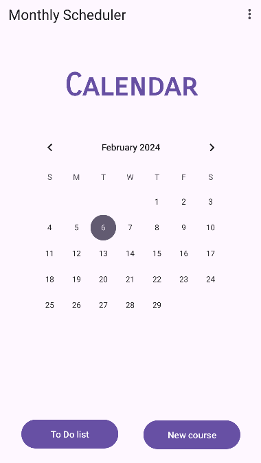
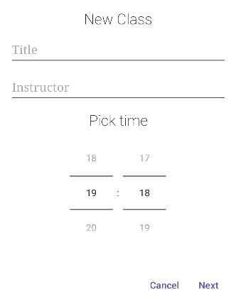
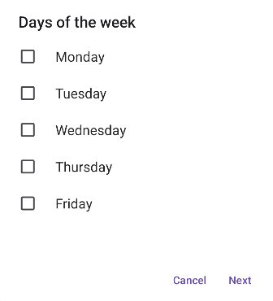
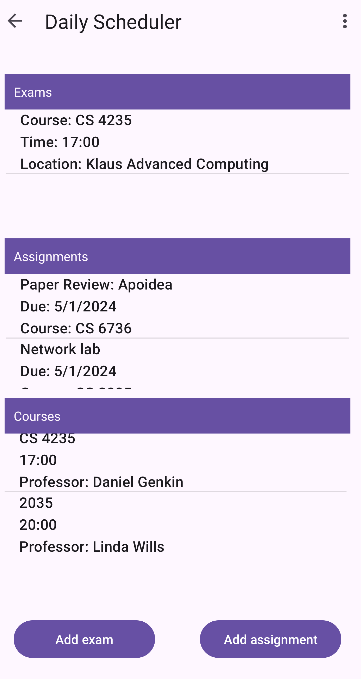
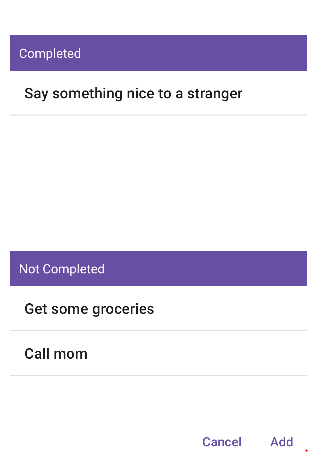

This is our project, College Schedule, made with Android Studio! It showcases what can be done with a basic understanding of Android Studio and Java. 
With this app, students can organize and track your class schedule, assignments, and exams. Stay on top of your academic commitments, prioritize tasks, and achieve success in your studies.

## Classes
One of the key features of our app is the ability for students to manage their class schedule for the semester. With the Class Management feature, students can add, edit, and delete class details, ensuring their schedule is always up to date and organized.

### Adding Class Details

When students want to add a new class to their schedule, they can do so easily by clicking on New course and using an modal window that will pop up. This modal window prompts students to enter essential class details such as the class name, professor's name, and class time. To facilitate entering the class time, students can use a simple clock interface, making the process quick and user-friendly.

After entering the basic class details, students are prompted with a multiple-choice list of days of the week that the class meets. This allows students to select the specific days on which the class takes place. By providing this flexibility, our app accommodates varying class schedules, including classes that meet on specific days only or have irregular meeting times.

### Deletion and Editing

Once a class is added to the schedule, students can check the details by tapping on the calendar for each day of the week that the class meets. This interaction allows students to quickly access information about their classes directly from the calendar view. By tapping on the class, students can view detailed class information and make any necessary edits or deletions.

## Assignments

In addition to managing their class schedule, our app offers students the ability to organize for the semester their assignments efficiently. With the Assignment Managment feature, students can add, edit, and track assignmes, ensuring they stay on top of their coursework for the semester.

### Adding Assignments
Assignments can be added to specific days on the calendar, allowing students to visualize their upcoming deadlines and prioritize their workload. By associating assignments with due dates directly on the calendar, students can better manage their time.

### Viewing and Managing Assignments

Once an assignment is added to the calendar, students can view and manage their assignments by tapping on the respective due dates. This action brings up a detailed view of the assignments, classes and exams on that date. By clicking on the assigment, students can review the details, delete it, or edit the information as needed.

## Exams
To further assist students in staying organized and prepared for their academic semester, our app offers a Exam Management feature. With this functionality, students can add, edit, and track their upcoming exams.

### Adding Exams
Adding exams to the schedule is a straightforward process. Students can simply tap on the day the exam is scheduled to take place, and then tap on the add exam button, triggering a modal window where they can input the course name, time and location.

### Managing Exams

Once an exam is added to the calendar, students can conveniently access and manage the exam details by tapping on the exam item on the list. This action opens a detailed view of the exam, where students can review and edit important information such as the exam time, location and class.

This is what a busy day looks like:

## To Do List

Lastly, on of the best features os the app is the capability to stay organized and on top of your tasks with a To Do lis. Whether students are managing assignments, personal errands, or extracurricular activities, the intuitive To Do list makes it easy to plan, track, and accomplish your goals, at the reach of a single button. 

The To Do list consists of two different sections: the `Not completed` and the `Completed` list. The `Not completed` list is where students can add, edit, and prioritize tasks, while the `Completed` list is where students can move completed tasks to keep track of their accomplishments.

